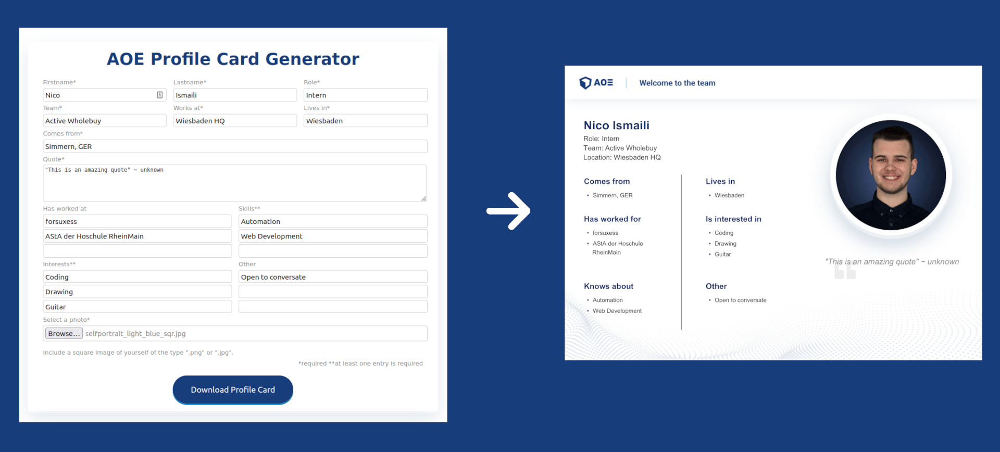

<h1 style="text-align: center;">(AOE) Profile Card Generator</h1>

A simple Go HTTP Server for handling multipart-form POST
requests and generating a profile card PDF from the provided data.

Please be advised: This project was merely meant to be an exercise for myself during my introduction to Go and is therefore by no means considered a finished project.

<div style="text-align: center">

</div>

## Prerequisites

Make sure you have the following installed on your machine:

- [Go](https://golang.org/doc/install)
- [wkhtmltopdf](https://wkhtmltopdf.org/downloads.html)
- optional: [Docker](https://docs.docker.com/get-docker/)

## Installation

1. Clone the repository 

```shell
git clone https://github.com/nico-i/profile-card-gen
```

2. Navigate to the project directory

```shell
cd profile-card-gen
```

3. Install all dependencies

```shell
go get .
```

4. Run the service

```shell
go run .
```

5. Try it out under [localhost:3000](http://localhost:3000)

## Docker

To run this service inside a docker container,
navigate to the project directory and run the following commands.

```shell
docker build --tag docker-profile-card-gen .
docker run -p 3000:3000 docker-profile-card-gen
```

## Notes

Currently, the design of the form and card is based on the branding
of AOE, but this can be fitted to your individual needs by editing
the CSS & HTML files inside the [public](./public) directory.

## Credits

Based upon the following repos/inputs:

- [docker-wkhtmltopdf](https://github.com/Surnet/docker-wkhtmltopdf)
- [Generating PDFs with Go ~ Diogo Simões](https://cloudoki.com/generating-pdfs-with-go/)


